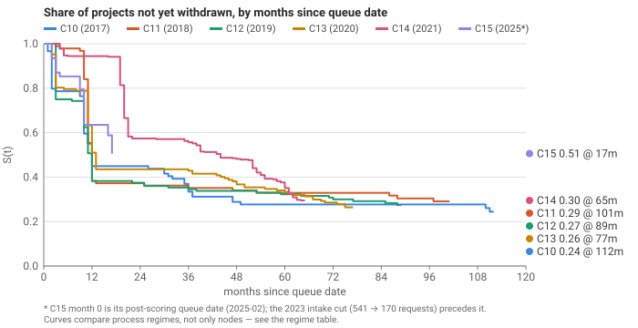
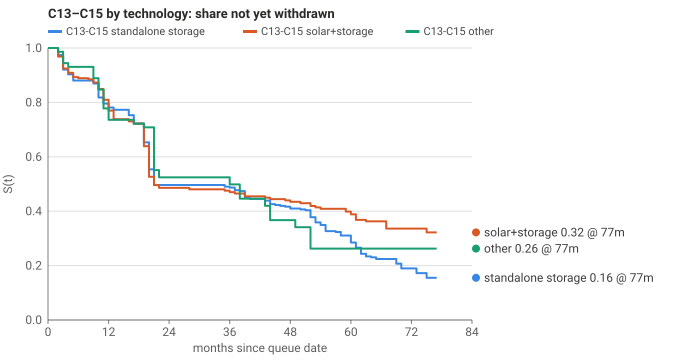

# Queue-cohort survival — Kaplan–Meier by cluster

Source: CAISO Public Queue Report (run date 2026-09-14) for C10–C14; CAISO Cluster 15 report for C15,
censored at its posting date 2026-07-16 — that file cannot record a withdrawal after it was published.
Event = withdrawal at `withdrawn_date`. ACTIVE rows are censored at the report run date; COMPLETED rows are
censored at `actual_cod` (completion is success, not an event). Time = months since `queue_date`.
`s12`…`s60` = Kaplan–Meier S(t) at 12…60 months; `_mw` = the same estimate with each project weighted by `net_mw`.
n/a = the cohort has not been observed that long with at least 5 projects still at risk (`follow_up_months`
is the last month that holds). No figure states a cause; the CAISO files carry none.

## Summary

| cohort                     |   n |   events |   censored |   mw_total |   follow_up_months |   median_survival_months |   s12 |   s24 |   s36 |   s48 |   s60 |   s12_mw |   s24_mw |   s36_mw |   s48_mw |   s60_mw |
|:---------------------------|----:|---------:|-----------:|-----------:|-------------------:|-------------------------:|------:|------:|------:|------:|------:|---------:|---------:|---------:|---------:|---------:|
| C10                        |  89 |       66 |         23 |     15,984 |                112 |                       12 |  0.45 |  0.45 |  0.33 |  0.29 |  0.28 |     0.60 |     0.60 |     0.49 |     0.44 |     0.43 |
| C11                        |  94 |       66 |         28 |     22,403 |                101 |                       12 |  0.38 |  0.37 |  0.35 |  0.34 |  0.33 |     0.32 |     0.31 |     0.28 |     0.27 |     0.27 |
| C12                        | 136 |       98 |         38 |     42,108 |                 89 |                       12 |  0.38 |  0.38 |  0.35 |  0.34 |  0.32 |     0.38 |     0.38 |     0.36 |     0.35 |     0.34 |
| C13                        | 147 |      108 |         39 |     42,129 |                 77 |                       13 |  0.51 |  0.44 |  0.43 |  0.37 |  0.33 |     0.51 |     0.40 |     0.40 |     0.33 |     0.29 |
| C14                        | 359 |      254 |        105 |    105,452 |                 65 |                       44 |  0.94 |  0.57 |  0.56 |  0.48 |  0.35 |     0.95 |     0.62 |     0.62 |     0.54 |     0.40 |
| C15                        | 170 |       84 |         86 |     59,013 |                 17 |              not reached |  0.64 |   n/a |   n/a |   n/a |   n/a |     0.63 |      n/a |      n/a |      n/a |      n/a |
| C13-C15 standalone storage | 352 |      259 |         93 |     92,296 |                 77 |                       21 |  0.78 |  0.50 |  0.49 |  0.41 |  0.29 |     0.78 |     0.49 |     0.49 |     0.42 |     0.30 |
| C13-C15 solar+storage      | 252 |      149 |        103 |     79,959 |                 77 |                       21 |  0.77 |  0.49 |  0.47 |  0.43 |  0.39 |     0.77 |     0.52 |     0.51 |     0.48 |     0.44 |
| C13-C15 other              |  72 |       38 |         34 |     34,340 |                 77 |                       36 |  0.74 |  0.52 |  0.50 |  0.37 |  0.26 |     0.74 |     0.53 |     0.53 |     0.35 |     0.19 |

## Findings

Among cluster cohorts with at least 24 months of follow-up, C11 shows the steepest 24-month attrition: 63% of its 94 projects had withdrawn by month 24, against 43% for C14, the shallowest. Cluster 15 has 17 months of follow-up so far; at month 12 its unweighted S is 0.64 and its MW-weighted S is 0.63, versus S(12) of 0.94 for C14 and 0.51 for C13 at the same age. Median time to withdrawal is reached for C10 at month 12, C11 at month 12, C12 at month 12, C13 at month 13, C14 at month 44; C15 has not yet crossed S = 0.5 within its follow-up. For C14 the MW-weighted S(24) of 0.62 is at or above the unweighted 0.57, so the projects that withdrew in the first two years were on average smaller than those that stayed. Within C13–C15 by technology, solar+storage has the lowest S(24) at 0.49 and other the highest at 0.52 (n = 252 and 72). Across the six cluster cohorts 995 projects enter the analysis, 676 withdrawals are events, 319 rows are censored (active at the report run date or completed at their on-line date — completion is success, not an event), and 0 rows were excluded for missing or inconsistent dates. Attrition compares regimes, not only nodes. C10–C13 entered under the standard cluster process; C14 entered in April 2021 at 2.4x the prior year's volume under special procedures that made Phase I cost estimates advisory and refunded deposits in full on early withdrawal when Phase II costs came in 25 % or more above Phase I; C15 is the first cohort scored and capped by zone under the 2023 IPE, and its queue date (2025-02-12) is the post-scoring date, so the 541 → 170 intake cut happened before its month 0. A flatter C14 or C15 curve is partly the rule change, not only the projects or the nodes.

## Process regime by cohort

| cohort   | queue window   | process the cohort entered under                                                                                                                                                                                                                                                                                                                                                                                                                                                        |
|:---------|:---------------|:----------------------------------------------------------------------------------------------------------------------------------------------------------------------------------------------------------------------------------------------------------------------------------------------------------------------------------------------------------------------------------------------------------------------------------------------------------------------------------------|
| C10      | 2017-05        | standard cluster study process                                                                                                                                                                                                                                                                                                                                                                                                                                                          |
| C11      | 2018-04        | standard cluster study process                                                                                                                                                                                                                                                                                                                                                                                                                                                          |
| C12      | 2019-04        | standard cluster study process                                                                                                                                                                                                                                                                                                                                                                                                                                                          |
| C13      | 2020-04        | standard cluster study process                                                                                                                                                                                                                                                                                                                                                                                                                                                          |
| C14      | 2021-04        | 373 requests / ~150 GW — 2.4x the prior year. Special FERC-approved procedures (Sept 2021): Phase I cost estimates advisory only; full deposit refund on early withdrawal if Phase II costs exceeded Phase I by 25 % or more; Phase I results delayed to Sept 2022.                                                                                                                                                                                                                     |
| C15      | 2025-02        | First cluster scored under the 2023 IPE (commercial interest 30 %, viability 35 %, system need 35 %) and capped at 150 % of available capacity per constraint. 541 requests / 347 GW filed in the April 2023 window; 255 resubmitted Oct–Dec 2024; 145 / 68 GW proceeded to study (CAISO, June 2025). The queue_date in the file is 2025-02-12, so month 0 here is AFTER that cut: this cohort is already a filtered survivor set and its early months are not comparable to C10–C14's. |

Full monthly table: `survival_by_cluster.csv`. Definitions: `DATA.md`.
